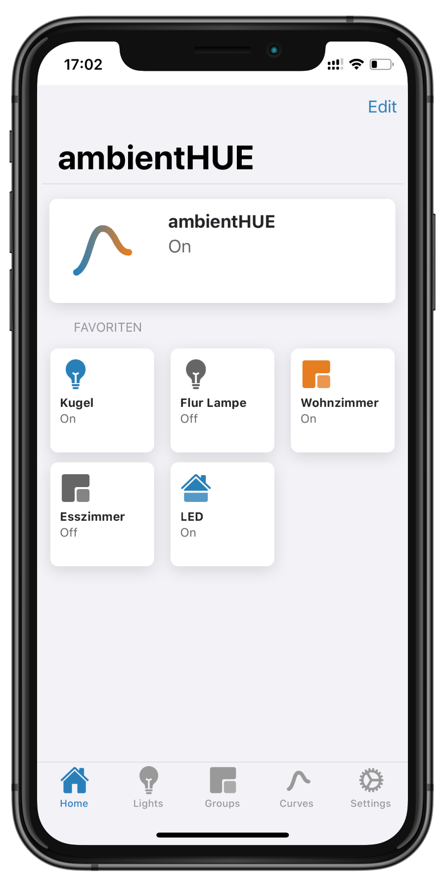
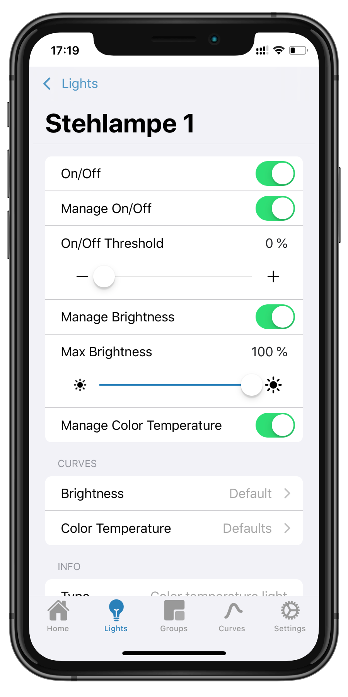
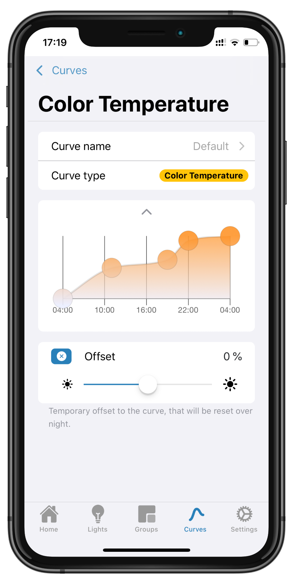
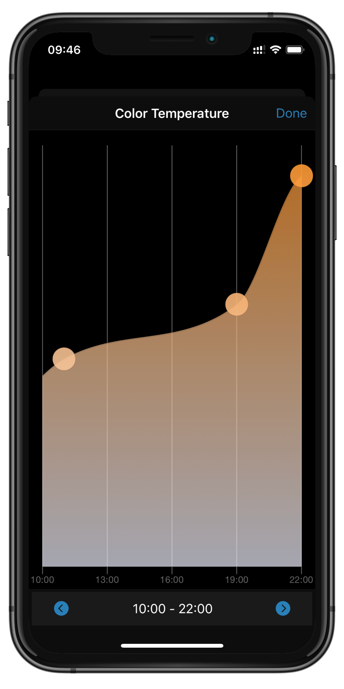
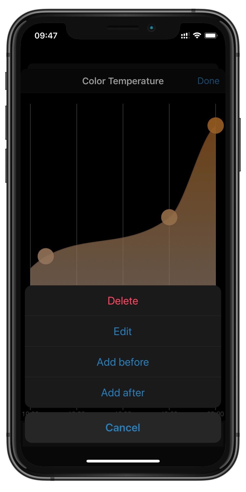
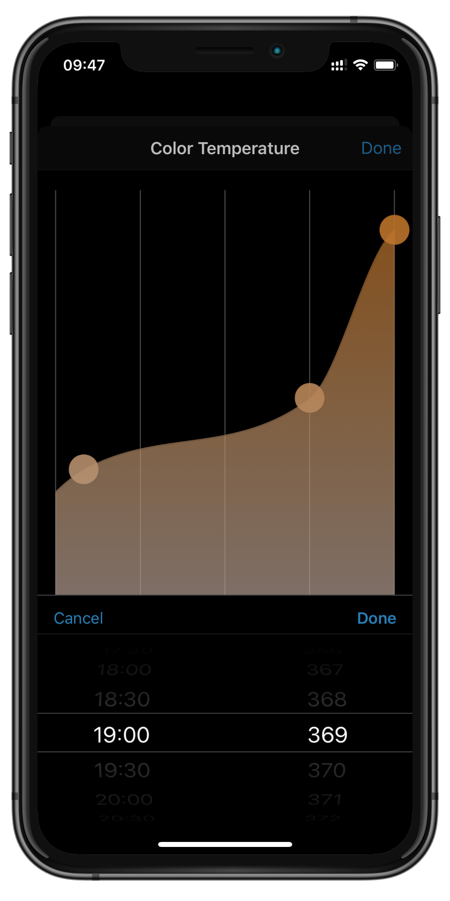
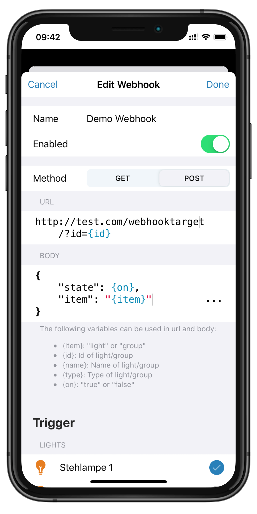

<p align="center">
    <em>Makes your smart lights smart</em>
</p>


<p align="middle">
    
    
    
</p>

ambientHUE dynamically adjusts your Philips Hue smart lighting 
(and any third party zigbee lights on your Hue bridge) based on your preferences 
throughout the day.
Simply setup ambientHue on a Raspberry Pi or any other server in your network 
and enjoy the new smartness of your lights.


ambientHue comes with a beautiful mobile first web application, an open API
with SwaggerUI documentation and extensive support for webhooks.
ambientHUE does not modify anything in your Hue bridge.


# Quickstart

The simplest way to run ambientHUE is using the Docker image. 
> **_NOTE:_**  Pay attention to use the correct timezone settings for your location!
```
docker run --name ambientHue -p 8080:80 -e "TZ=Europe/Berlin" lukaspatzke/ambienthue
```

To make your settings persist use a docker volume:
```
docker volume create --name ambienthue-data
docker run --name ambientHue -p 8080:80 -v "ambienthue-data:/data" \
    -e "DB_CONN=sqlite:////data/db.sqlite" \
    -e "TZ=Europe/Berlin" --restart always lukaspatzke/ambienthue
```

If you prefer to use Docker Compose:
```yml
volumes:
    data:
        driver: local

services:
    ambient-hue:
        image: lukaspatzke/ambienthue
        restart: always
        container_name: ambient-hue
        ports:
            - 8080:80
        volumes:
            - data:/data
        environment:
            - TZ=Europe/Berlin
            - DB_CONN=sqlite:////data/db.sqlite
```
As a default, ambientHue uses a local Sqlite database for persistence. 
You may however replace it with your preferred database supported by SQLAlchemy.


## Setup the HUE Bridge

Open up the web interface at http://localhost:8080 and start the HUE Bridge setup.
Select your bridge if it can be detected automatically or enter the IP address manually.
Press the button on top of your bridge to allow ambientHUE to access your lights.

## First Steps

Select a light from the lights tab and enable ambientHUE:

 * On/Off controlled: Switch on the light if the calculated brightess exceeds the On/Off threshold - and switch off the light if the light level falls below the threshold
 * Brightness controlled: Dynamically adjust the brightness level according to the set curve. Define a maximum brightness in order to tune in with other lights controlled by ambientHue.
 * Color Temperature controlled: Dynamically adjust the color temperature according to the set curve.

You can add the web application to your homescreen on iOS and Android devices and 
install it as a Google Chrome App on your desktop.

# Features

ambientHue allows you to dynamically adjust the brightness and color temperature 
of your lights and groups.

## Favorites

For quick access, you can add lights and groups to your favorites on the start page.
Press the edit button in the top right corner and select or deselect the items.

## Custom Curves


You can create custom curves and assign different lights and groups to each of them.
You can edit the curves by moving points via drag and drop. Create or
delete points by longpress, or right click on non touch devices

<p align="middle">
    
    
    
</p>

## Smart Off

Since ambientHUE runs periodically in the background, it would by default override any manual
changes to your controlled lights. To prevent this behaviour, you can enable 
the "Smart Off" feature.

Before every run, ambientHUE will then check whether a light's state has changed since the previous 
update. If that is the case, the light is considered to be user controlled and will not be overriden until the 
light is put back to the previous state or until the next day.

## Webhooks



Webhooks provide the capability to integrate ambientHue with other applications. The webhooks can 
be triggered if the controlled state of a light or group changes. 

You can configure a 
GET or POST request to an arbitrary URL and specify the POST request body. URL and body
can both contain parameters which will be filled with their respective values on execution. 

Available parameters are:
 
| Parameter | Type               | Description                                         |
|-----------|--------------------|-----------------------------------------------------|
| {item}    | "light" \| "group" | Type of the trigger                                 |
| {id}      | Integer            | ID of the trigger, matches the ID in the Hue Bridge |
| {name}    | String             | Name of the trigger                                 |
| {type}    | String             | Type of the trigger                                 |
| {on}      | Boolean            | Whether the trigger was turned on or off            |


>**_EXAMPLE:_** : The webhook url 
>```
>http://192.168.178.2:51828/?accessoryId=ambientHUE_{item}_{id}&state={on}
>```
>might be called as
>```
>http://192.168.178.2:51828/?accessoryId=ambientHUE_light_3&state=true
>```
> if "On/Off" for light 3 is switched to on.


### Homebridge Webhook Assistant

[Homebridge](https://github.com/homebridge/homebridge) is an awesome project that allows you to integrate 3rd-party APIs in Apple HomeKit.

With the help of the Homebridge Webhook Assistant you can easily define a webhook in
ambientHUE and create the configuration for the [Homebridge HTTP Webhook Plugin](https://github.com/benzman81/homebridge-http-webhooks).

 * Start the Assistant on the settings page.
 * Enter the URL of your Homebridge HTTP Webhook Plugin and press "Next". This will 
    probably look something like "http://yourHomebridgeServerIp:webhook_port"
 * Select the lights and groups that you want to control with HomeKit and press "Next".
 * Copy the generated configuration to the clipboard and paste it into your Homebridge 
    config.json under the section "lights".
 * Finish the Assistant by pressing "Done".

 **_Example_** Homebridge configuration:
 ```json
 {
    "bridge": {
        "name": "Homebridge",
        "username": "XX:XX:XX:XX:XX:XX",
        "port": 51826,
        "pin": "XXX-XXX-XXX"
    },
    "accessories": [],
    "platforms": [ {
            "platform": "HttpWebHooks",
            "webhook_port": "51828",
            "cache_directory": "/homebridge/persist_webhooks",
            "lights": [
                {
                    "id": "ambientHUE_group_1",
                    "name": "ambientHUE Wohnzimmer",
                    "on_url": "https://localhost:8080/api/groups/1",
                    "on_method": "PUT",
                    "on_body": "{ \"on\" : true }",
                    "off_url": "https://localhost:8080/api/groups/1",
                    "off_method": "PUT",
                    "off_body": "{ \"on\" : false }"
                },
                {
                    "id": "ambientHUE_group_4",
                    "name": "ambientHUE Esszimmer",
                    "on_url": "https://localhost:8080/api/groups/4",
                    "on_method": "PUT",
                    "on_body": "{ \"on\" : true }",
                    "off_url": "https://localhost:8080/api/groups/4",
                    "off_method": "PUT",
                    "off_body": "{ \"on\" : false }"
                },
            ],
        }
    ]
 }
 ```

## API Documentation

ambientHUE comes with a beautiful API documentation provided by fastapi. You can access the SwaggerUI at http://localhost:8080/api/docs or the alternative ReDoc at 
http://localhost:8080/api/redoc.


# Development

Prequisites:
 * Python ^3.7
 * node.js

```
git clone https://github.com/LukasPatzke/Ambient-Hue.git

cd ambientHUE/app
npm install @ionic/cli
npm install
ionic serve

cd ../api
python3 -m venv venv
source venv/bin/activate
pip install -r requirements.txt

export PYTHONPATH=.
alembic upgrade head

uvicorn app.main:app --host 0.0.0.0 --port 8080 --log-level debug --reload
```


## Language Support

The web application currently supports English and German. 
If you speak another language, feel encouraged to contribute by adding the
respective language files. Have a look at ./app/src/translations/en.json for reference.

Thanks a lot for your contribution!

## License

ambientHUE is licensed under the MIT License. See the LICENSE file for more information.

